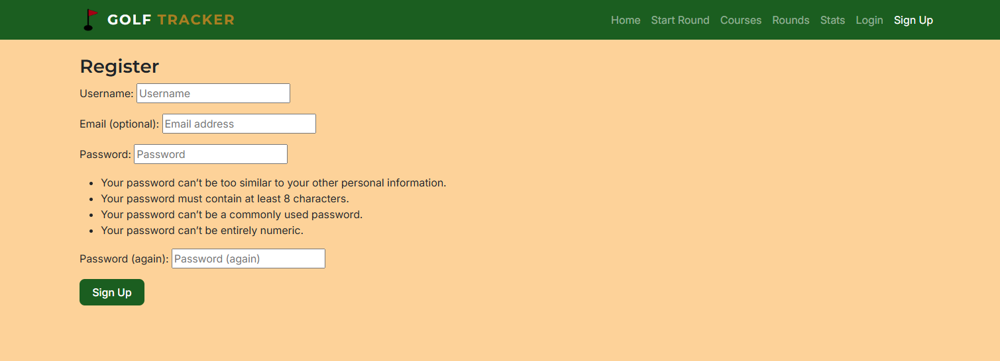
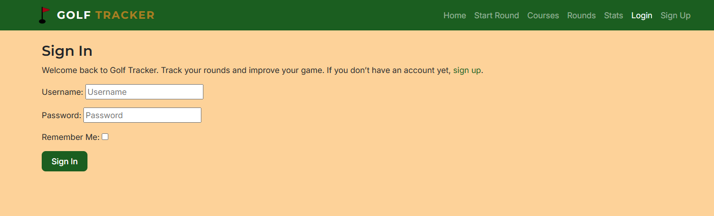
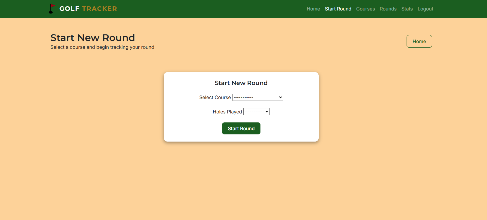
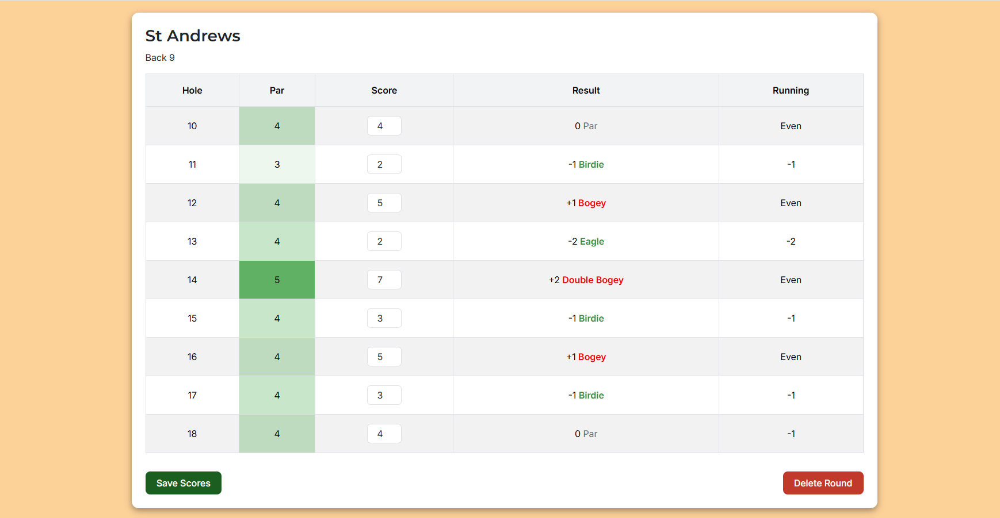
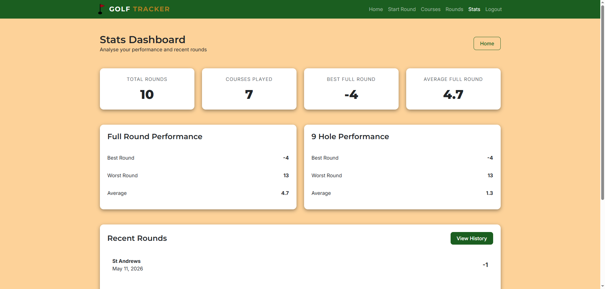
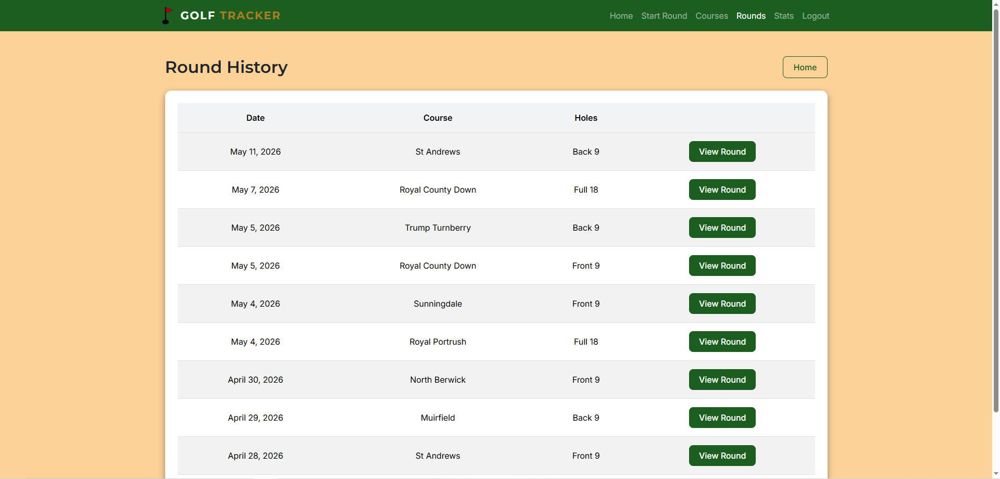
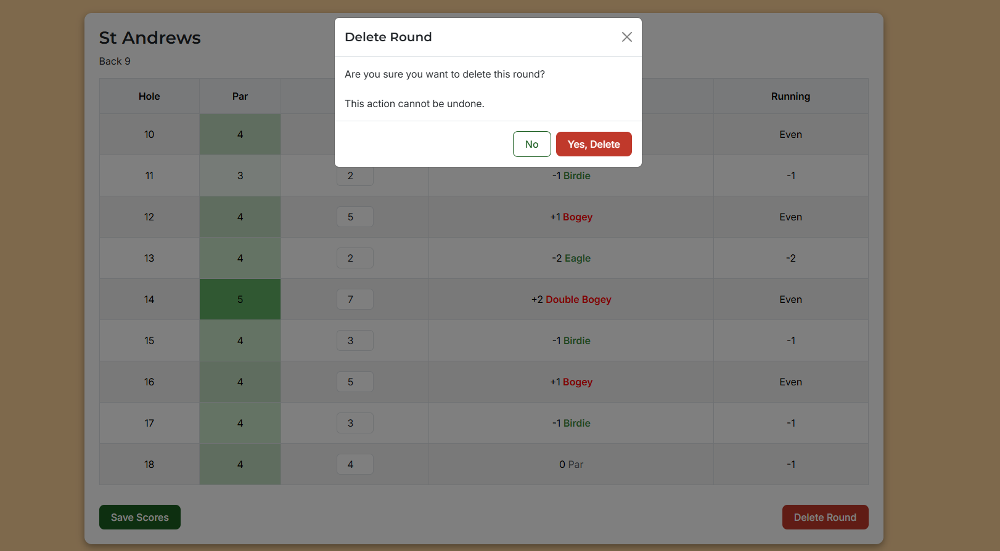
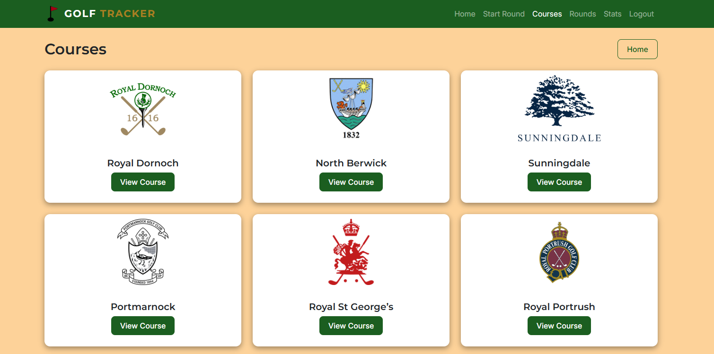
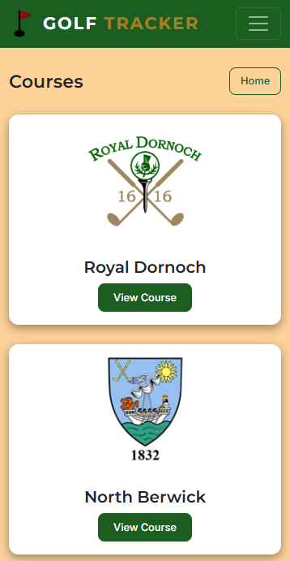
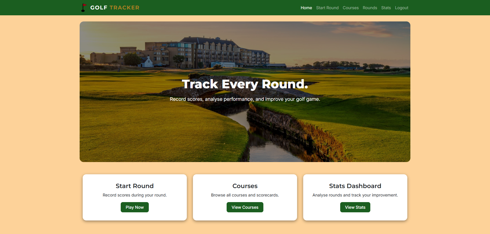

# UX
## Project Goals
The goal of Golf Tracker is to provide users with an intuitive and responsive web application for recording and reviewing golf rounds. The application allows users to record their full 18 hole scores as well as front or back 9 hole scores, compare their performance against par, and see their improvement over time through a clean and user-friendly dashboard.

The project was designed with a focus on:
* Creating an intuitive and responsive user experience across all device sizes
* Allowing users to record and review golf scores during or after a round
* Providing meaningful statistics and historical data to help users track performance
* Implementing CRUD functionality using Django models, views and templates
* Building a visually polished and consistent application using Bootstrap and CSS styling

## User Stories
As a user, I want:
1. To create an account, so that I can save and track my golf scores over time

    **Acceptance Criteria**
    * User can access a registration page
    * User must enter username and password
    
    

2. To log in to my account, so that I can access my previous rounds and personal statistics

    **Acceptance Criteria**
    * User can access login page
    * Valid credentials log user in successfully
    * Invalid credentials display an error message

    

3. To choose a golf course before starting a round, so that the correct holes and par values are loaded

    **Acceptance Criteria**
    * User can view list of courses from database
    * User can select a single course
    * Selected course is stored for the round

4. To select whether I am playing the front 9, back 9, or full 18 holes, so that the application shows the correct holes

    **Acceptance Criteria**
    * User can select front 9, back 9, or full 18 holes
    * Selection is required before starting a round
    * Correct holes are loaded for the round

    

5. To input my strokes for each hole, so that my performance is recorded accurately

    **Acceptance Criteria**
    * Each hole has a score input field
    * Only valid numbers are accepted
    * Each score is linked to correct hole and round

6. To see whether I am over or under par for each hole, so that I can understand my performance throughout the round

    **Acceptance Criteria**
    * Par is calculated correctly
    * Each hole shows score vs par
    * Results update after saving scores

    

7. To see my total score and overall performance after finishing a round, so that I can evaluate how well I played

    **Acceptance Criteria**
    * Total strokes are calculated correctly
    * Total par is calculated correctly
    * Overall score (over/under par) is displayed

    

8. To view my previous rounds, so that I can track my progress over time

    **Acceptance Criteria**
    * User sees only their own rounds
    * Each round shows date, course, and score

    

9. To delete an unwanted round, so that I can remove incorrect or unnecessary records from my history

    **Acceptance Criteria**
    * Users can delete an unwanted round
    * A confirmation modal appears before deletion

    

## Wireframes
## Design Choices
The application uses a golf-inspired colour palette using greens and neutral tones to create a clean and professional appearance.

### Color Scheme
* Dark Green (#1b5e20) - Navigation & primary buttons
* Light Green (#4caf50) - Home & Back buttons
* Sand (#fdd299) - Page background
* White (#ffffff) - Card background colour
* Dark Grey (#212529) - Text colour

Additional colours were used to visually distinguish par 3, par 4, and par 5 holes as well as good or bad scores while maintaining readability and consistency with the overall theme.

### Fonts
* **Montserrat:** used for headings and branding elements to provide a strong and modern appearance
* **Inter:** used for body text to improve readability across desktop and mobile devices

### Layout
The application was designed using a card-based layout to organise content into clear and manageable sections. Bootstrap was used throughout the project to ensure pages are responsive across all screen sizes.

Consistent spacing, button styling, and navigation placement were applied across all pages to create an intuitive user experience.

Cards and tables were customised with responsive styling to allow readability on smaller screen sizes.

### Imagery
Course logo images were used throughout the application to create stronger visual identity and improve recognition between courses. Images were resized and optimised before use to reduce file size and improve loading performance.

The homepage uses a large hero section with an image of St Andrews to create a more engaging first impression while maintaining the clean and professional aesthetic used throughout the rest of the application.

# Database Design
## Models
## Relationships

# Features
## Existing Features
### User Authentication
- Users can create an account
- Users can log in and log out of their account
- Django authentication allows users to see their specific data while preventing showing data from other users

### Homepage
- Responsive homepage with hero section to detail what the application is used for
- Navigation bar and cards for easy access to key pages within the application

### Course List
- Users can browse available golf courses
- Each course includes a logo image
- Responsive card layout across screen sizes

### Course Detail
- Users can view course scorecards
- Par values are colour coded for readability
- Users can start a round directly from the page

### Start Round
- Users can select a course
- Users must choose front 9, back 9, or full 18 holes

### Round Detail / Score Entry
- Users can enter and update scores for each hole
- Running totals are calculated automatically
- Score versus par is displayed dynamically
- Responsive scorecard layout improves usability on mobile devices

### Round Summary
- Total strokes are calculated automatically
- Total par and overall score versus par are displayed
- Round performance updates after score submission

### Round History
- Users can view previous rounds
- Rounds are ordered by most recent first
- Each round displays date, course, holes played and link to see detailed view of the round

### Statistics Dashboard
- Displays total rounds played
- Displays best, worst, and average scores
- Tracks unique courses played
- Displays 5 most recent rounds

### Delete Round
- Users can delete unwanted rounds
- Bootstrap modal confirmation prevents accidental deletion
- Deleted rounds are removed from round history and statistics

## CRUD Functionality
**Create:** Users can create new golf rounds

**Read:** Users can view courses, rounds, statistics, and scorecards

**Update:** Users can update scores for existing rounds

**Delete:** Users can delete rounds using a confirmation modal

# Technologies Used
## Languages
## Frameworks & Libraries
## Tools

# Testing
## Manual Testing
## User Story Testing
## Controls
## Responsive Design
## Visual Feedback
## Validator Testing
## Bugs & Fixes

# Deployment
## GitHub Deployment
## Heroku Deployment

# Credits